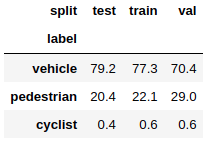
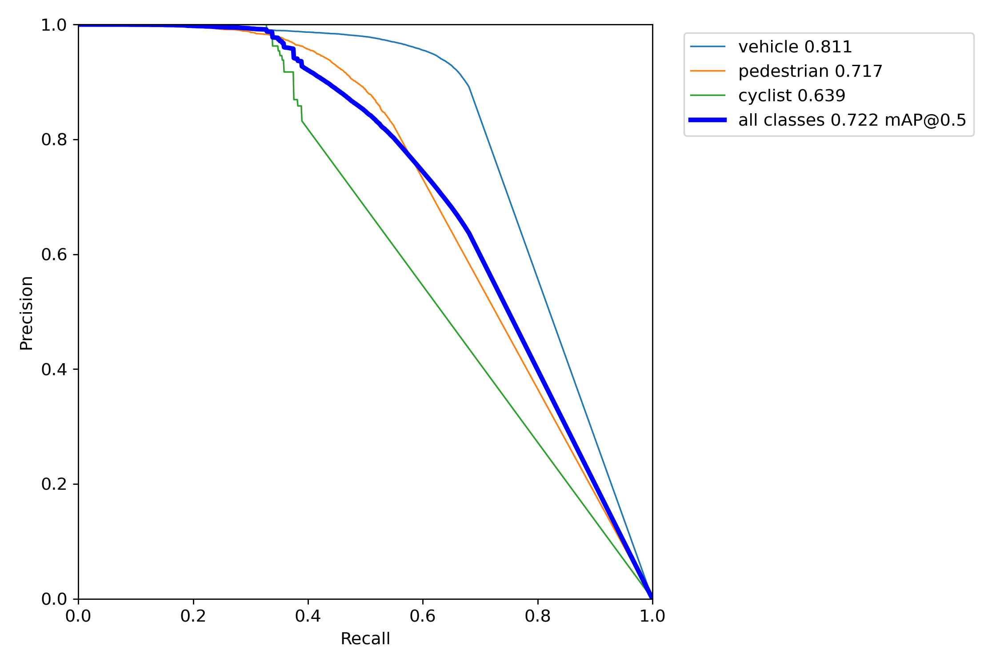

# Object Detection in an Urban Environment
Here you can see object detection pipeline using data from [Waymo Real-time 2D Detection](https://waymo.com/open/challenges/2021/real-time-2d-prediction/) (only the first 100 training TFR files, amounting to 94 GB) as part of my [Self-Driving Nanodegree](https://www.udacity.com/course/self-driving-car-engineer-nanodegree--nd0013). 
I've tried [Tensorflow OD API](https://github.com/tensorflow/models/tree/master/research/object_detection) and [Pytorch's Detectron2](https://github.com/facebookresearch/detectron2) but ultimately decided to go with [Ultralytics' YOLOv5](https://github.com/ultralytics/yolov5) due to its superiority in terms of both accuracy and speed.

### Prerequisites
To launch train/test pipeline you are expected to have aforementioned 100 TFR files in `/mnt/waymo_od` on your machine. 
To build docker images with necessary environment, clone this repo to `$HOME/nd013c1_yolo`, move to [/build](https://github.com/quezee/nd013c1_yolo/tree/master/build) and use these commands:

`docker build -t nd013c1_yolo -f Dockerfile.main .` 
`docker build -t tensorboard -f Dockerfile.tb .`

### How to launch train/test
Default process for `nd013c1_yolo` container is jupyter-notebook server.
After launching it with [docker-compose.yml](https://github.com/quezee/nd013c1_yolo/blob/master/build/docker-compose.yml), enter inside with 
`docker exec -it build_nd013c1_1 bash` and `cd project`. 
`python process_raw_data.py` will populate [/data](https://github.com/quezee/nd013c1_yolo/tree/master/data) folder with processed images and annotations. Now you are ready to train/test by `sh`'ing [train.sh](https://github.com/quezee/nd013c1_yolo/blob/master/train.sh) or [val.sh](https://github.com/quezee/nd013c1_yolo/blob/master/val.sh) respectively.

## Data and cross-validation split
 
Visual and statistical inspection of data is conducted in [Exploratory Data Analysis.ipynb](https://github.com/quezee/nd013c1_yolo/blob/master/Exploratory%20Data%20Analysis.ipynb) (it may not load right away on github page, just reload until it appears). Also cross-validation split with its justification is done there.

Here we deal with 3 classes: `vehicle, pedestrian, cyclist`, which are hugely imbalanced.
 **Class balance**
  
Only 0.57% of objects are `cyclist`. What is more, their distribution across TFR source files is very skewed.
 **Cyclists per source file distribution**
  
Which suggests we should not rely on random cross-val splits, but rather stratify them by this class. 
With this approach I got the following class-split distribution:
 **Class balance by split, %**
  

## Training runs
- [model01](https://github.com/quezee/nd013c1_yolo/tree/master/runs/train/model01): baseline run with all default parameters suggested in [YOLOv5 repo](https://github.com/ultralytics/yolov5). **Test mAP@.5: 0.575**.
- [model02](https://github.com/quezee/nd013c1_yolo/tree/master/runs/train/model02): increased image size from 640 to 1280. **Test mAP@.5: 0.66**.
- [model03](https://github.com/quezee/nd013c1_yolo/tree/master/runs/train/model03): here I've done lots of tweaking by numerous runs with different optimizers, learning rates, regularization strength, augmentations and even tried heavier version of YOLOv5 (which didn't help). I've also increased image size to 1500. **Test mAP@.5: 0.685**.

**Validation set mAP@.5 by model vs epoch**
  

Adam optimizer and mixup augmentation appeared to be the most deteriorating non-default parameters, while mosaic augmentation and high image resolution gave the most boost to accuracy. As was expected, cyclists became a bottleneck for mAP.
 **Precision-Recall curve (model03)**
  
**Confusion matrix (model03)**
  
I've tried to fight it by tuning focal loss gamma (to impose more weight on cyclist objects), but it didn't help. 
My train set contains only 2k cyclists (while 255k and 73k of vehicles and pedestrians respectively), so I guess there's not much to do about it besides extending train set.